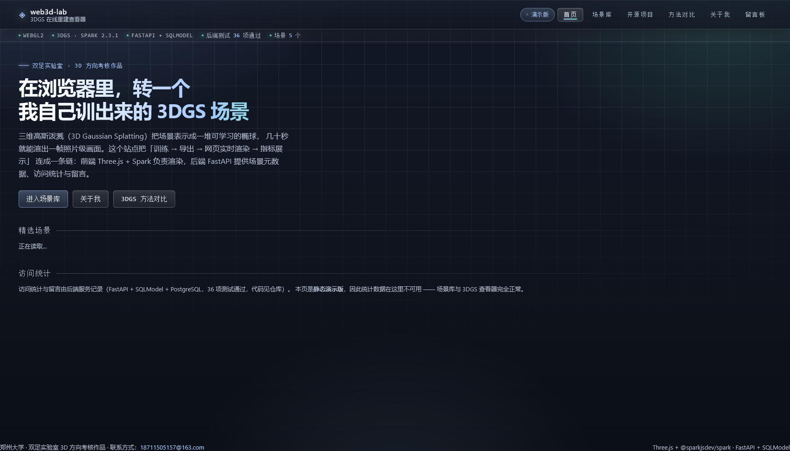
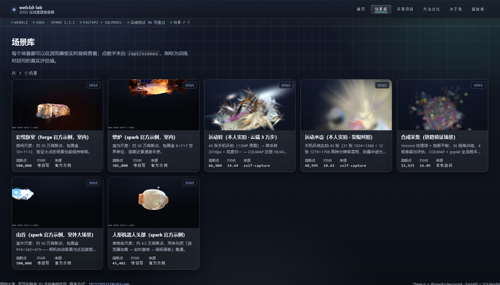

# web3d-lab —— 3DGS 在线重建查看器 + 个人主页

**在线预览**：[www.shawnlab.cn](https://www.shawnlab.cn/)（主站 · 后端在线：留言板可写、访问统计实时）
　·　[GitHub Pages 镜像](https://shawn100861224.github.io/web3d-lab/)（纯静态备用，场景照常渲染）



*首页：深色技术风 + 精选场景（数据来自后端接口）+ 实时访问统计。*



*场景库：7 个场景的卡片（点数与指标都来自后端接口，不是写死的），点进去就是浏览器里的实时 3DGS 渲染 —— 拖拽旋转、滚轮缩放、右键平移，右侧是训练指标与「本次渲染实测」（高斯数从资产文件解析、加载耗时与帧率是当前机器实测）。*

> 双足实验室招新考核作品（3D / 三维视觉方向）。**前后端一体**，核心卖点：访客能在浏览器里实时旋转作者亲手训练的 3D Gaussian Splatting 场景，并看到真实训练指标。

## 为什么是它（定位）

- 考核里绝大多数人交静态个人主页；能把**自己训出来的 3DGS 场景**放进网页实时渲染的几乎没有 —— 这就是差异化的全部。
- 后端不是装饰：场景元数据/指标、访问统计、留言板、渲染帧率回写，都是真接口。
- 与「软件工程」身份对齐：前端工程化 + API 设计 + 数据库 + 容器部署，一条链都能讲。

## 技术栈（已定）

| 层 | 选型 | 说明 |
|---|---|---|
| 前端 | Vite + React + TypeScript | 页面/路由 |
| 3D 渲染 | Three.js + `@sparkjsdev/spark` | 支持 ply/spz/splat/ksplat；官方有 R3F 模板 |
| 后端 | Python 3.10 + FastAPI + SQLModel（本地 SQLite / 线上 PostgreSQL） | 与训练脚本同语言，任务队列不用跨语言 |
| 训练 | WSL2 Ubuntu-24.04 + PyTorch(cu12x) + gsplat + COLMAP | 本机 RTX 5060 8GB，只做小场景（单物体/桌面） |
| 部署 | EdgeOne Pages（静态）+ EdgeOne Cloud Functions（FastAPI 后端）+ Neon 免费 Postgres | 同域 `/api/*`、免备案、¥0；GitHub Pages 作为纯静态镜像 |
| 测试 | pytest + httpx（后端）、Playwright（端到端） | 验收用真实浏览器点一遍 |

**明确不用 Electron**：交付形态是「一个链接」。Electron 要下载安装包、手机打不开、3D 能力零增益；将来真要桌面版，用 Tauri 套壳（~5MB）而不是现在。

## 模块与验收标准

状态由 `.devloop/state.json` 维护，`PROGRESS.md` 由脚本渲染 —— **不要手写 PROGRESS.md**。

| # | 模块 | 验收方式 |
|---|---|---|
| 1 | 脚手架 | 前后端各一条命令能起，页面/JSON 有响应 |
| 2 | 场景元数据 API | `curl /api/scenes` 返回预期 JSON + 空结果路径 |
| 3 | 3DGS 查看器页 | 浏览器打开能转、能显示指标面板（截图为准） |
| 4 | 场景库与路由 | 卡片从 API 拉取，点击进详情 |
| 5 | 访问统计 | POST 写库后 `/api/stats` 曲线变化 |
| 6 | 留言板 | POST/GET 通，注入 `<script>` 被转义，有限流 |
| 7 | 个人主页与方法对比 | 并入 `lab/web-3d` 的内容，3DGS 方法对比成页 |
| 8 | 训练管线 | COLMAP → 3DGS → 导出 .spz + 指标回写（**需要照片**） |
| 9 | 部署 | 一键脚本组装 + 命令行部署（EdgeOne Pages 静态 + Cloud Functions 后端 + Neon Postgres），`scripts/verify-cloud.sh` 可重复验收（**发布前问用户**） |

## 本地开发命令（模块 1 起可用）

（运维类说明——启动脚本、本地/线上地址的区别——不写进本文件，见 `HANDOFF.md`。）

```bash
# 后端（端口 8000）
cd D:/lab/web3d-lab/backend && .venv/Scripts/python.exe -m uvicorn app.main:app --reload --port 8000

# 前端（端口 5173，dev server 已把 /api 反代到 8000）
cd D:/lab/web3d-lab/frontend && npm run dev
```

自检：浏览器开 http://127.0.0.1:5173/scenes/robot-head ，应看到左侧视口里可旋转的 3DGS 场景 + 右侧指标面板。

## 前端验收钩子

查看器把实时状态镜像到 DOM 的 `#viewer-state`（`data-status` / `data-splats` / `data-fps` /
`data-camera` / `data-extent` / `data-bbox` / `data-error`），Playwright 与脚本用它断言，
不用去猜画面。相关脚本：`frontend/scripts/check_render.py`（截图像素级判空画布）。

## 示例资产（frontend/public/demo/）

目录里有 **5 个可渲染资产**：4 个示例 `.spz`（约 19 MB，来自 spark 官方示例清单 `sparkjs.dev`
的 `examples/assets.json`）+ 1 个**自训导出**的 `.splat`（1.0 MB，见最后一行）。
示例资产用于「先把链路跑通」；真实照片到位后会用实拍场景替换掉最显眼的位置。
重新拉取用 `frontend/scripts/fetch-demo-assets.sh`（**必须走 Clash 代理**，直连 sparkjs.dev 速度为 0）。

| 文件 | 点数 | 包围盒（世界单位） | 实测 |
|---|---|---|---|
| `robot-head.spz` | 45,401 | 单物体 | 加载 0.5s，headless 下 76–147 FPS |
| `fireplace.spz` | 301,000 | 8.2×6.5×7.0 | 正常 |
| `painted-bedroom.spz` | 500,000 | 10.3×7.3×11.5 | 正常 |
| `valley.spz` | 500,000 | 915.9×341.6×414.8 | 正常，需按宽高比取景 |
| `toy-capture.splat` **（自训）** | 32,925 | 1.75 | 合成采集 40 视角 → COLMAP 40/40 注册 → gsplat 训练 7000 步导出；线上实测 35–37 FPS，加载约 0.9s |

**踩过的坑（模块 8 导出 .spz 时必看）**：`snow-street.spz`（官方示例之一，981,908 点）
在 spark 2.3.1 下 `numSplats` 能解析成 981,908，但 `getBoundingBox()` 返回**空盒**
（size 全为 ±Infinity）、画面全黑。解压后对比头部发现它与其他文件不同：

```
NGSP v2 头：magic(4) version(4) numPoints(4) shDegree(1) fractionalBits(1) flags(1) reserved(1)
robot-head       sh=3  fractionalBits=12   ← 正常
valley/fireplace sh=0  fractionalBits=12   ← 正常
snow-street      sh=2  fractionalBits=6    ← 空盒、画面全黑
```

结论：**导出自训场景时用 fractionalBits=12**（gsplat / spark `writeSpz` 的默认值），
不要用 6。查看器里已对退化 bbox 做了兜底（退回半径 1 的机位），但兜底救不回数据本身。
诊断脚本：`frontend/scripts/inspect_spz.mjs`（离线读点位）、`frontend/scripts/check_render.py`
（对截图做像素级「非空画布」判定）。

## 新会话怎么接手（重要）

- **真相源是本文件 + `PROGRESS.md` 的自动区**（后者由 `devloop.py` 渲染，禁止手写）。
  `HANDOFF.md` 是**另一条线**写的交接表（可能滞后），当参考读、不要当唯一依据。
- **续跑**：读 `PROGRESS.md` 看「进行中/待办」，跑
  `python <skills>/autonomous-ai-agents/autonomous-dev-loop/scripts/devloop.py check`
  从下一个模块接着做；不要重新侦察已定的技术栈。
- **恢复原对话**：桌面端左栏点这条会话，或 `hermes --resume <session_id>`。
- **自主开发循环**默认开启：不停下等确认，但**拍摄照片、发布上线、花真钱、注册第三方账号**这四类必须停下来问本人。

## 环境快照（截至 2026-10-05）

- **部署（2026-10-06 更新）**：公开主入口 → **`https://www.shawnlab.cn`** ✓
  （自有域名，已配 HTTPS 证书 · 加速区域选「全球可用区（不含中国大陆）」故**免备案** ·
  电脑与手机流量均实测可访问 ✓）
  GitHub Pages 作为镜像：`https://shawn100861224.github.io/web3d-lab/`
  （国内部分网络下不稳 ✗ —— 同一台电脑能开、手机流量白屏 —— 所以改为自有域名为主入口 ✓）
  接入方式：腾讯云 EdgeOne Makers 项目 `web3d-lab`（Maker 预览域名 `*.edgeone.dev` 带鉴权返回 401 ✗，**不要对外提供**）。
- **训练环境**（WSL2 Ubuntu-24.04，详见 `pipeline/README.md`）：torch 2.14.1+cu130 / RTX 5060 Laptop（sm_120）/
  COLMAP 3.9.1（apt 版无 CUDA）/ **自拼的 CUDA 13.4 工具链**（`cuda-nvcc-13-4` + `libnvvm-13-4`，CUDA 13 把 nvvm 改名了）/
  gsplat 走 JIT 编译（缓存于 `~/.cache/torch_extensions`）。python 环境 `~/web3d/venv`，数据 `~/web3d/data/`。
- 已装技能（见 `hermes skills list`）：`ui-ux-pro-max`、`ui-styling`、`fastapi`、`playwright`、`3d-orbit-inspect-demo`。
- Hermes(profile 10086) 主模型 = native `deepseek`/`deepseek-flash`（走 `api.deepseek.com`，不需代理），别名 `ofox` 可回切。
  **¥6 赠金已于 2026-10-05 全部用尽**（6.00 → 0.00，在 10/6 21:00 过期前烧完），账户余额 ¥26.23。
  费用细节与省钱杠杆见 `HANDOFF.md` 第三节。
- 本机：RTX 5060 Laptop 8GB / 16GB DDR5 / D 盘余 ~600GB。
- 网络要点（都踩过）：直连 `sparkjs.dev` 速度 0 → 必须走 Clash 代理；GitHub 直连慢（推 20MB 约 2 分钟）；
  npmmirror / 清华 PyPI 源反过来**要关代理**；`wsl.exe` 内联命令里别用 shell 变量（会被外层吞掉，写脚本文件）。
